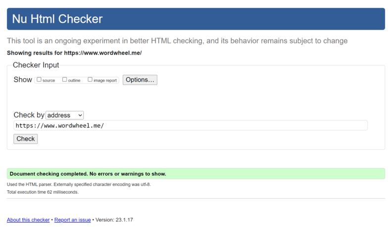
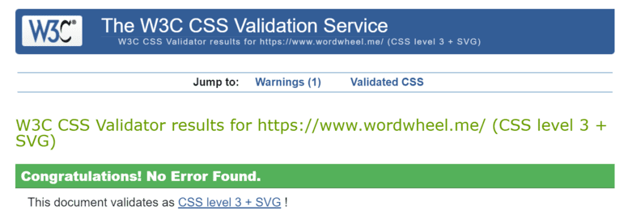
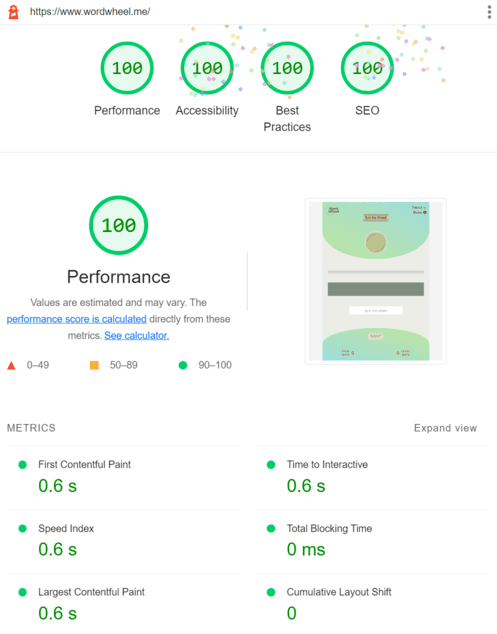
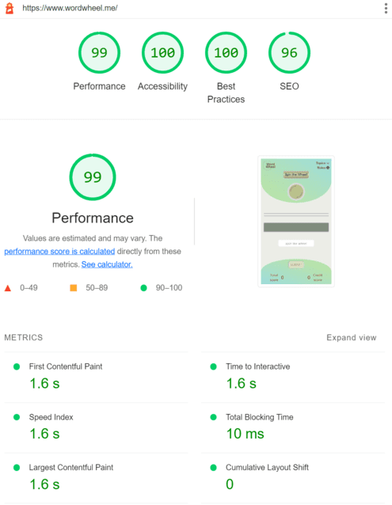

# Testing

## Contents

- [Manual Testing](#manual-testing)
- [Compatibility Testing](#compatibility-testing)
  - [Browser Compatibility](#browser-compatibility)
  - [Device Compatability and Responsiveness Testing](#device-compatability-and-responsiveness-testing)
- [Validator Testing](#validator-testing)
  - [HTML Validation](#html-validation)
  - [CSS Validation](#css-validation)
  - [JS Validation](#js-validation)
  - [Accessibility and Performance](#accessibility-and-performance)
- [Bugs/Issues](#bugsissues)

## Manual Testing

- [x] Page responsiveness
- [x] Navigation hover effect
- [x] Displaying the box of rules by clicking on a `Rules` button
- [x] Closing the rules box with the X button
- [x] Closing the rules box with the `Have a Good Game!` button
- [x] Opening a developer repository in a new tab via a link in the rules box
- [x] Expanding the dropdown menu by clicking on a `Topics` button
- [x] Hiding the dropdown menu by clicking on a `Topics` button
- [x] Hiding the dropdown menu after selecting a certain topic
- [x] Starting the game cycle and wheel animation by pressing the `space bar`
- [x] Starting the game cycle and wheel animation by clicking on a `Spin the Wheel` button
- [x] User notifications when starting the game if no topic is selected
- [x] Highlighting the topic button if no topic is selected when starting the game
- [x] Deactivation the `Spin the Wheel` button after a single click and successful start
- [x] Stopping the wheel animation when word and definition are displayed
- [x] Displaying question mark inside the wheel if word and definition is displayed
- [x] Displaying definition
- [x] Displaying letters by clicking on the tile
- [x] Unblocking the input field if word and definition are displayed
- [x] Highlighting the input field if the word and definition are displayed
- [x] Unblocking the `submit` button if the word and definition are displayed
- [x] User notifications when submitting the answer if the input field is empty
- [x] Submitting the answer by pressing the `Enter` key
- [x] Revealing the whole word if the user submitted an incorrect answer
- [x] Revealing the whole word if the user submitted a correct answer
- [x] Replenishment of the `credit score` at the beginning of the game cycle, which is the number of letters in the word
- [x] Deducting one point by each revealed letter from the `credit score`
- [x] Resetting the `credit score` at the end of the game cycle
- [x] Adding the remaining points from the `credit score` to the `total score`, when submitted a correct answer
- [x] Resetting the `total score` when submitted an incorrect answer
- [x] Disabling the `submit` button after submitting the answer
- [x] Unblocking the `spin the wheel` button after the answer submitted

[Back to top](#contents)

## Compatibility Testing

### Browser Compatibility

The game was tested on the following browsers:

- Google Chrome
- Mozilla Firefox
- Microsoft Egde

The app worked well across all browsers and discrepancies were not found.

### Device Compatability and Responsiveness Testing

The app was tested using Google Chrome Developer Tool - Device Mode Toolbar.

#### Tested devices:

- iPhone SE
- iPhone 12 Pro
- Pixel 5
- Samsung Galaxy S8+
- Samsung Galaxy S20 Ultra
- iPad Air
- iPad Mini
- Surface Pro 7
- Surface Duo
- Galaxy Fold
- Samsung Galaxy A51
- Nest Hub
- Nest Hub Max
- iPad
- iPadPro

[Back to top](#contents)

## Validator Testing

### HTML Validation

The [W3C Markup Validation](https://validator.w3.org/) Service was used to validate the HTML of the website.
HTML code passes throught the official W3C validator with no issues
[_Click to re-validate this page_](https://validator.w3.org/nu/?doc=https%3A%2F%2Fwww.wordwheel.me%2F)

### CSS Validation

All styles passed the CSS validator without errors.
The [W3C Jigsaw CSS Validation](https://jigsaw.w3.org/css-validator/) Service was used to check the CSS style sheet.

_Click to re-validate this page_

### JS Validation
**JS code** passes throught a [Jshint.com](https://jshint.com/) linter with no issues

[Back to top](#contents)

### Accessibility and Performance

The [Google Chrome LightHouse](https://developer.chrome.com/docs/lighthouse) was used to do the Web Accessibility and Performance Audit

|Desktop Test|Mobile Test|
|-|-|
 |  |

[Back to top](#contents)

## Bugs/Issues
When the Dictionary API not responding or is at fault, the game doesn't work as it doesn't receive definitions.
The user is notified when the API returns status code 500 - Internal Server Error, not responding for 5 or more seconds or getting a 'Failed to fetch' error message.
#### Unresolved
- 100vh is not constant in a mobile browser. The page takes up the full height of the screen only when the site bar is hidden on the scroll up.

### Error handing
- [x] To handle errors that occur during data processing were created custom error handlers that extend the native `Error` object.
Custom error handlers help catch specific errors and provide better control over code flow.
- [x] The code intelligently handles empty or invalid data.
- [x] API calls that fail to execute or return data will be handled gracefully, with the site users notified in an obvious way
- [x] All input data is validated.
- [x] Internal errors are handled gracefully, and users are notified of the problem where appropriate.

[Back to top](#contents)

[Back to README.md](https://github.com/FlashDrag/word-wheel/blob/master/README.md#testing)
